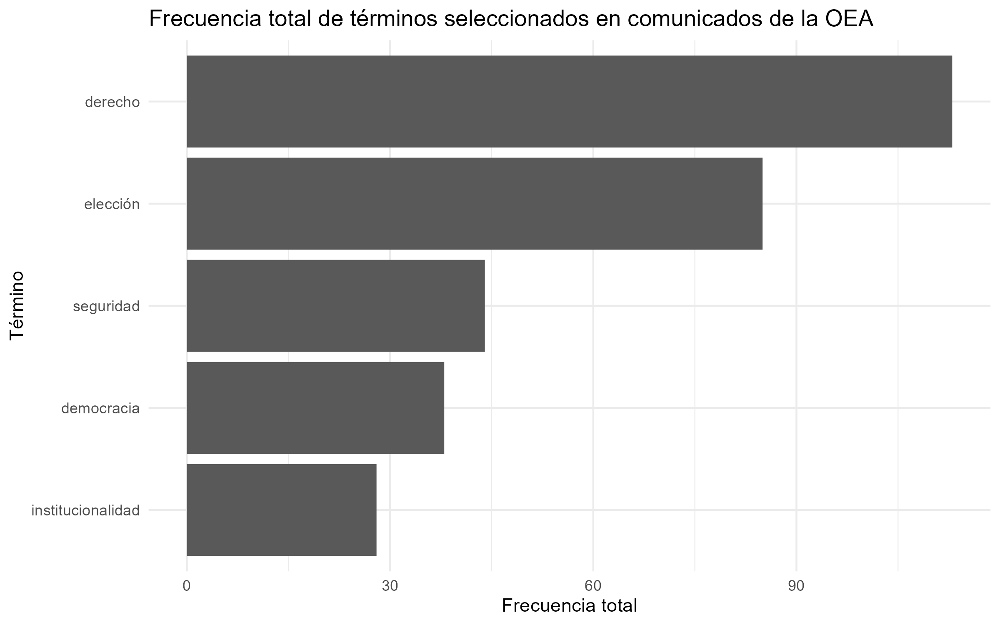

######################### 

# TP individual n°2

# Abril Silva Weinbaur

# Informe final

######################### 

## Correr el código

```{r}
library(here)

# Ejecutar cada etapa en orden
source(here("TP2", "scripts", "scraping_oea.R"))
source(here("TP2", "scripts", "processing.R"))
source(here("TP2", "scripts", "metrics_figures.R"))
```

## Informe

Entre enero y abril de 2026, la agenda pública de la Organización de los Estados Americanos estuvo fuertemente atravesada por grandes situaciones políticas en América Latina y el Caribe.

Entre estas situaciones podemos identificar:

#### En enero y febrero:

-   La captura de Nicolás Maduro en Venezuela a principios de enero

-   La frágil situación en Haití

-   El panorama electoral en Honduras

-   La misión especial en Guatemala para fortalecer la institucionalidad democrática.

#### En marzo y abril:

-   Misiones de observación electoral en Bolivia, Perú y Colombia

Estos casos muestran que la OEA no se concentró en un solo país ni en un solo problema, sino en una agenda regional más amplia, donde se comparten puntos en común:

#### - Democracia

#### - Institucionalidad

#### - Elecciones

#### - Derechos

#### - Seguridad

Por eso, el trabajo parte de esta hipótesis: Entre enero y abril de 2026, el discurso público de la OEA se concentró principalmente en la defensa de la democracia, la institucionalidad y el Estado de derecho frente a crisis políticas, procesos electorales sensibles y problemas de seguridad regional.

Para analizar esta hipótesis vamos a medir los términos que identificamos anteriormente: democracia, institucionalidad, elección, derecho y seguridad.

## Interpretación del gráfico



##### El gráfico muestra la frecuencia total de esos cinco términos en los comunicados analizados.

El gráfico indica que el término con mayor frecuencia es “derecho”, seguido por “elección”. Esto sugiere que el discurso de la OEA durante estos meses estuvo muy ligado a dos dimensiones centrales: por un lado, la defensa de derechos y del orden jurídico; por otro, la observación y el acompañamiento de procesos electorales.

A su vez, aparecen con fuerza “seguridad”, “democracia” e “institucionalidad”, que aunque tienen menos apariciones que “derecho” y “elección”, siguen siendo relevantes para entender el contexto americano. En conjunto, estos términos muestran que la OEA no habló solamente de elecciones como hechos técnicos, sino como parte de una preocupación más amplia por la estabilidad democrática, la legalidad y la protección institucional en la región.

## Resultados

En este sentido, los resultados acompañan la hipótesis inicial. La frecuencia de palabras muestra que, entre enero y abril de 2026, la OEA construyó una agenda pública centrada en democracia, derechos, elecciones, seguridad e institucionalidad. Esto coincide con el contexto regional del período: Venezuela, Haití, Guatemala, Honduras, Bolivia, Perú y Colombia aparecen como casos donde la organización intervino, observó o se pronunció frente a situaciones políticas sensibles.
